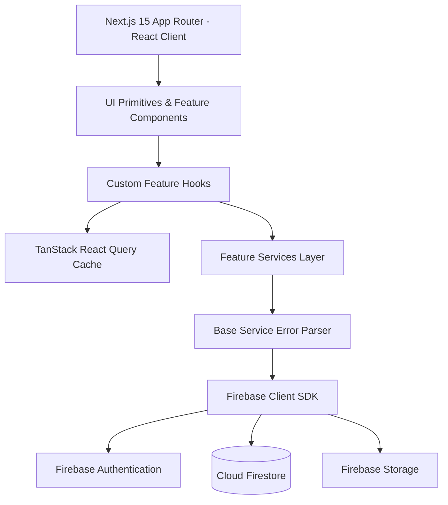
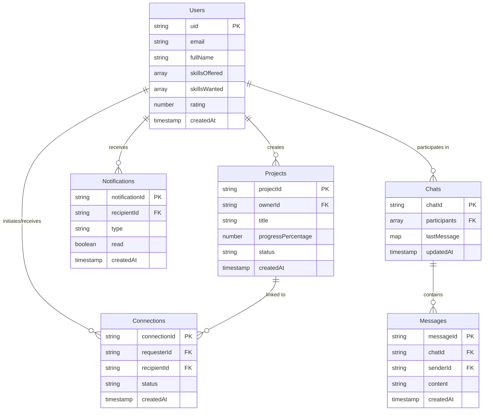
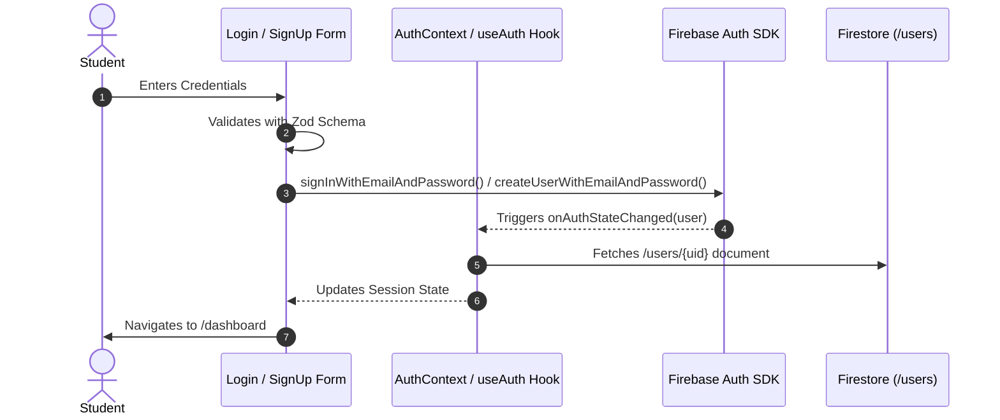
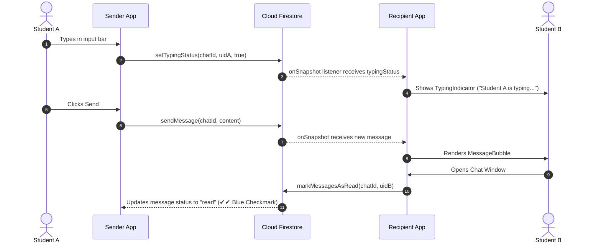

# 🚀 SkillSwap - Enterprise Student Collaboration & Skill Exchange Platform


**SkillSwap** is a production-ready, full-stack student collaboration platform designed to empower students to exchange skills, discover project partners, communicate in real time, and build real-world portfolios together.

Built with **Next.js 15 (App Router)**, **TypeScript**, **Tailwind CSS**, **Zod**, **TanStack React Query**, and **Google Firebase (Authentication, Firestore, Storage)** following strict **Feature-Based Clean Architecture**.

---

## 📖 Table of Contents

1. [System Architecture](#1-system-architecture)
2. [Folder Structure](#2-folder-structure)
3. [Firestore Database Schema](#3-firestore-database-schema)
4. [Authentication Flow](#4-authentication-flow)
5. [Deterministic Skill Matching Engine v2](#5-deterministic-skill-matching-engine-v2)
6. [Real-Time One-to-One Chat Flow](#6-real-time-one-to-one-chat-flow)
7. [Project Collaboration Flow](#7-project-collaboration-flow)
8. [Production Deployment Guide](#8-production-deployment-guide)
9. [Troubleshooting & FAQ Guide](#9-troubleshooting--faq-guide)

---

## 1. System Architecture

SkillSwap adheres to **Feature-Based Clean Architecture**, enforcing separation between domain business logic, UI presentation components, and infrastructure service abstractions.



### Core Architecture Highlights

- **Framework**: Next.js 15 (App Router with Server Components & Client Boundaries).
- **Type Safety**: Strict TypeScript compiler options with `@/*` absolute path alias mappings.
- **Validation**: Runtime Zod schemas for forms (`authSchema`, `profileSchema`, `projectSchema`) and environment variable validation (`config/env.ts`).
- **State & Cache**: TanStack React Query (`staleTime: 5 mins`, `gcTime: 10 mins`) minimizing Firestore reads.
- **Error Handling**: Centralized error parser (`errorHandler.ts`) normalizing Firebase, Zod, Network, and Runtime exceptions into user-friendly alerts.

---

## 2. Folder Structure

```text
SkillSwap/
├── .env.example                  # Environment variable schema template
├── .env.local                    # Local environment secrets (Ignored by Git)
├── .eslintrc.json                # ESLint rules integrated with Next.js core web vitals
├── .prettierrc & .prettierignore # Prettier formatting & Tailwind class sorting
├── firebase.json                 # Firebase CLI deployment specifications
├── firestore.rules               # Production Firestore security rules
├── storage.rules                 # Production Firebase Storage security rules
├── firestore.indexes.json        # Composite index definitions
├── next.config.ts                # Next.js compiler settings
├── package.json                  # Dependencies & npm scripts
├── postcss.config.mjs            # PostCSS processing (Tailwind + Autoprefixer)
├── tailwind.config.ts            # Tailwind styling tokens & Shadcn variables
├── tsconfig.json                 # TypeScript strict compiler config & `@/*` path mapping
├── vercel.json                   # Vercel deployment configuration
└── src/
    ├── app/                      # Next.js 15 App Router (Routing, Layouts, Metadata, API routes)
    │   ├── (auth)/               # Login, Register, Forgot Password routes
    │   ├── (dashboard)/          # Dashboard, Profile, Matches, Projects, Chat, Search
    │   ├── error.tsx             # Global error boundary fallback
    │   ├── globals.css           # Global design tokens & CSS custom variables
    │   ├── layout.tsx            # Root layout wrapping AppProvider
    │   ├── loading.tsx           # Global skeleton loading fallback
    │   └── page.tsx              # Public landing page
    ├── components/               # Cross-feature shared UI primitives & structural components
    │   ├── common/               # Header, Footer, ErrorBoundary, OfflineIndicator
    │   └── ui/                   # Button, Input, Card, Badge, Alert, Avatar, Skeleton, Spinner, EmptyState
    ├── config/                   # Global configuration & environment validation
    │   └── env.ts                # Zod runtime environment variable parser
    ├── constants/                # Immutable global constants (ROUTES, SITE_CONFIG)
    ├── features/                 # Modular Domain Features (Encapsulated)
    │   ├── auth/                 # Authentication (LoginForm, SignUpForm, authService, useAuth)
    │   ├── notifications/        # Realtime Notifications (NotificationItem, NotificationListGroup, useNotifications)
    │   ├── projects/             # Projects Collaboration (CreateProjectModal, ProjectCard, projectService)
    │   ├── skills/               # Skill Matchmaker (skillMatcher.ts, MatchBadge, MatchCard)
    │   └── users/                # Student Profile & Search (ProfileCard, searchService, useSearchStudents)
    ├── firebase/                 # Dedicated Firebase Client Module (config.ts, index.ts)
    ├── hooks/                    # Domain-agnostic custom hooks (useDebounce, useMediaQuery)
    ├── lib/                      # Infrastructure integrations (queryClient.ts)
    ├── providers/                # Client-side React context wrappers (AppProvider, QueryProvider)
    ├── services/                 # Enterprise base service abstractions (baseService.ts)
    ├── types/                    # Shared TypeScript interfaces (api.ts, firestore.ts)
    └── utils/                    # Utility helpers (cn, errors, errorHandler, searchTokens)
```

---

## 3. Firestore Database Schema

The database consists of **6 primary collections** engineered for zero-join reads and $O(1)$ query scaling:



### Collection Specifications & Paths

1. **`Users`** (`/users/{userId}`): Stores student profiles, department, semester, skills offered/wanted, rating, and search tokens.
2. **`Projects`** (`/projects/{projectId}`): Stores collaboration projects, required skills, member list, and progress percentage (0-100%).
3. **`Chats`** (`/chats/{chatId}`): Stores active direct conversation sessions, participant UIDs, last message preview, and unread counts.
4. **`Messages`** (`/chats/{chatId}/messages/{messageId}`): Subcollection storing immutable chat message history.
5. **`Connections`** (`/connections/{connectionId}`): Stores connection requests between students (`pending`, `accepted`, `rejected`, `blocked`).
6. **`Notifications`** (`/notifications/{notificationId}`): Stores in-app alerts (`connection_request`, `connection_accepted`, `new_message`, `project_invitation`).

---

## 4. Authentication Flow



### Route Protection

The `ProtectedRoute` wrapper component intercepts unauthenticated navigation attempts to protected routes (`/dashboard`, `/profile`, `/projects`, `/chat`, `/matches`), automatically redirecting to `/login`.

---

## 5. Deterministic Skill Matching Engine v2

The Skill Matcher calculates exact 2-way compatibility scores between students using mathematical set operations:

### Mathematical Match Formula

Let $U_A = (O_A, W_A)$ and candidate $U_B = (O_B, W_B)$:

$$\text{Direct Need Ratio } R_{A \leftarrow B} = \frac{|O_B \cap W_A|}{\max(1, |W_A|)}$$

$$\text{Reciprocal Need Ratio } R_{B \leftarrow A} = \frac{|O_A \cap W_B|}{\max(1, |W_B|)}$$

$$\text{Complementary Score } C = 0.60 \cdot R_{A \leftarrow B} + 0.40 \cdot R_{B \leftarrow A}$$

$$\text{Shared Skills Score } S = \frac{|O_A \cap O_B|}{|O_A \cup O_B|}$$

$$\text{Final Score } M = \min\left(100, \text{Math.round}( (0.70 \cdot C + 0.15 \cdot S + \mu) \times 100 )\right)\%$$

_($\mu = 0.15$ if mutual 2-way swap exists; $0$ otherwise)._

### 5-Tier Deterministic Ranking Tuple

Sort Vector: $V(U_B) = \Big( M(U_A, U_B), \quad |O_B \cap W_A|, \quad \text{rating}(U_B), \quad \text{completedSwaps}(U_B), \quad -\text{strcmp}(\text{uid}_B, \text{uid}_A) \Big)$

---

## 6. Real-Time One-to-One Chat Flow



---

## 7. Project Collaboration Flow

1. **Create Project**: Student fills title, description, required skill tags, and initial status (`open`).
2. **Invite & Join Workflows**: Owners can send invites to candidate students; students can submit join requests.
3. **Progress Tracking**: Owners update project completion percentage (0% to 100%), auto-syncing status (`in_progress` -> `completed`).
4. **Owner Permission Enforcement**: Firestore Security Rules (`firestore.rules`) enforce that only `ownerId == request.auth.uid` can edit project details or update progress.

---

## 8. Production Deployment Guide

### Option A: Deployment to Vercel (Recommended)

1. Push repository to GitHub.
2. Import project at [vercel.com/new](https://vercel.com/new).
3. Configure Environment Variables:
   - `NEXT_PUBLIC_FIREBASE_API_KEY`
   - `NEXT_PUBLIC_FIREBASE_AUTH_DOMAIN`
   - `NEXT_PUBLIC_FIREBASE_PROJECT_ID`
   - `NEXT_PUBLIC_FIREBASE_STORAGE_BUCKET`
   - `NEXT_PUBLIC_FIREBASE_MESSAGING_SENDER_ID`
   - `NEXT_PUBLIC_FIREBASE_APP_ID`
4. Click **Deploy**. Vercel will build and assign an SSL domain (`https://skillswap.vercel.app`).
5. Add your Vercel URL to [Firebase Console -> Auth -> Authorized Domains](https://console.firebase.google.com/project/skillswap-fe53d/authentication/settings).

### Option B: Deploy Security Rules & Indexes via Firebase CLI

```bash
npm install -g firebase-tools
firebase login
firebase deploy --only firestore:rules,firestore:indexes,storage
```

---

## 9. Troubleshooting & FAQ Guide

### Q1: `Firebase App named '[DEFAULT]' already exists`

- **Cause**: Re-initializing Firebase App during Next.js Hot Module Replacement (HMR) or Server-Side Rendering (SSR).
- **Solution**: Handled automatically via guarded singleton pattern in `src/firebase/index.ts`:
  `const app = getApps().length > 0 ? getApp() : initializeApp(firebaseConfig);`

### Q2: `auth/unauthorized-domain` Error during Login

- **Cause**: Trying to log in from a local domain or Vercel URL not listed in Firebase Console.
- **Solution**: Navigate to Firebase Console -> Authentication -> Settings -> Authorized Domains and add `localhost` or your Vercel deployment URL.

### Q3: `permission-denied` Error on Firestore Write

- **Cause**: Client attempting to modify protected fields or write to another user's document.
- **Solution**: Ensure your request adheres to `firestore.rules`. For example, `rating` and `completedSwaps` are immutable from client SDKs.

### Q4: ESLint `Cannot find module 'es-abstract'`

- **Cause**: Stale cache or interrupted `npm install`.
- **Solution**: Run `npm install -D es-abstract --legacy-peer-deps` to refresh resolution trees.

---

## 📜 License & Credits

Built with ❤️ by the SkillSwap Team. Distributed under the MIT License.
